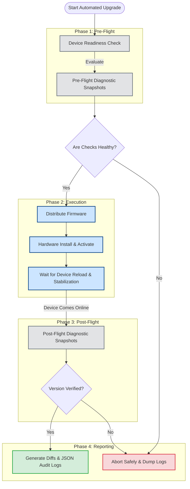
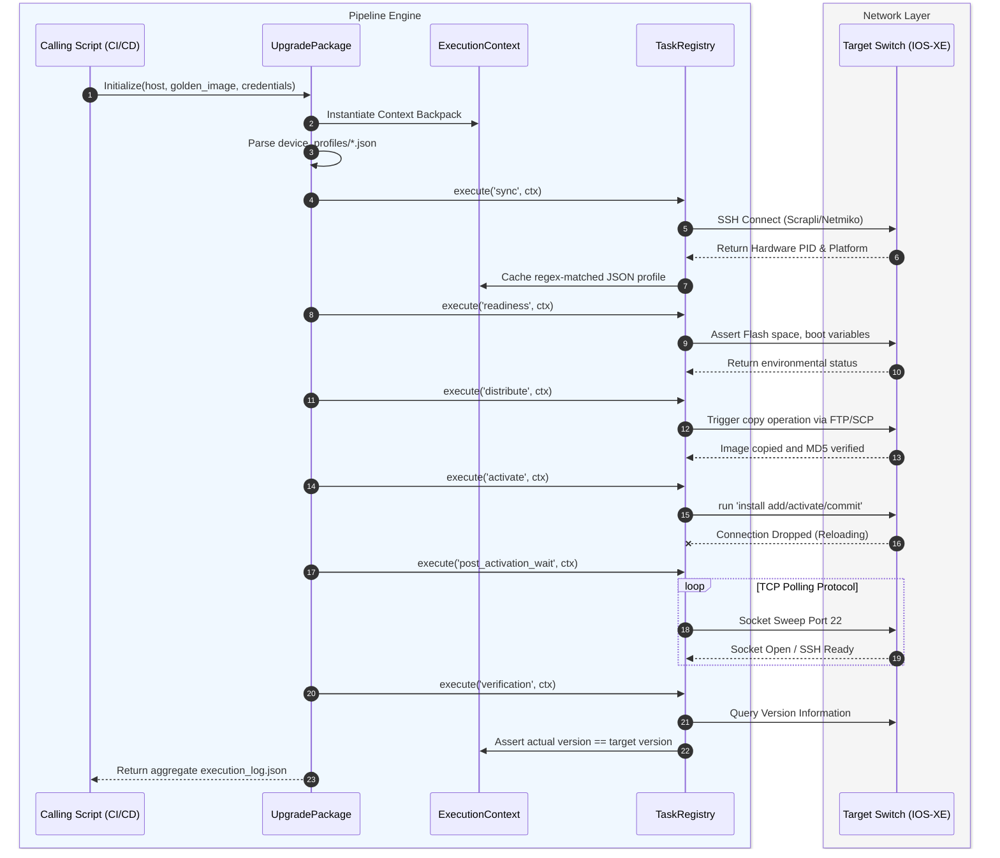

# simple-upgrade Orchestration Engine
## Architecture & Workflow Documentation

This document provides the structured architectural blueprints for both technical integrators and management stakeholders. The diagrams below are written in `mermaid.js` and can be pasted directly into Atlassian Confluence using the `/mermaid` macro.

---

## 1. High-Level Design (HLD)
**Target Audience**: Project Managers, Network Architects, Non-Technical Stakeholders.
**Purpose**: Illustrates the overarching business logic and fail-safes built into the automated pipeline.

### Executive Summary
The `simple-upgrade` engine is an idempotent, profile-driven automation pipeline designed to eliminate manual intervention during Cisco network hardware upgrades. It enforces a strict "Pre-Flight, Execution, Post-Flight" methodology to guarantee network stability and full auditability. 

### HLD Workflow Diagram
*To view this diagram in Confluence, type `/mermaid`, hit Enter, and paste the block below:*

---

## 2. Low-Level Design (LLD)
**Target Audience**: DevOps Engineers, Software Developers, Automation Specialists.
**Purpose**: Details the internal object states, programmatic dependencies, and API flow of the execution engine.

### Architectural Core Concepts
1. **`UpgradePackage` Orchestrator**: The master runtime controller that manages sequential stage invocation.
2. **Dynamic Profiling**: Discards hardcoded logic in favor of regex-matched JSON templates (`device_profiles/`) mapped to dynamic interfaces and stack matrices.
3. **`ExecutionContext` Backpack**: An immutable state manager (`ctx`) that securely transports target hardware metrics, SSH references, and success booleans seamlessly between isolated stages.
4. **`TaskRegistry` Router**: A decorator-driven system (`@register_stage`) that dynamically links manufacturer-agnostic commands to manufacturer-specific implementations (e.g. Cisco IOS-XE).

### LLD Sequence Execution Diagram
*To view this diagram in Confluence, type `/mermaid`, hit Enter, and paste the block below:*

---

## 3. Supported Action Matrix
When explaining the scope to management, these are the natively supported execution capabilities verified in the architecture:

| Capability | Supported Specifications |
|---|---|
| **Target Manufacturers** | Cisco |
| **OS Platforms** | IOS-XE (`cisco_xe`) |
| **Tested Hardware Families** | Catalyst 9300 (`C9300-.*`), Catalyst 9300X (`C9300X-.*`), Catalyst 9300L (`C9300L-.*`), VIOS |
| **Image Transfer Protocols** | HTTP, HTTPS, TFTP, FTP, SCP |
| **Data Encoding & Validation** | Checksums (MD5, SHA-256), Pydantic Strict Typing |
| **Connection Backends** | Scrapli (`ssh2` accelerated), Genie/Unicon/pyATS (Interactive dialogs) |
